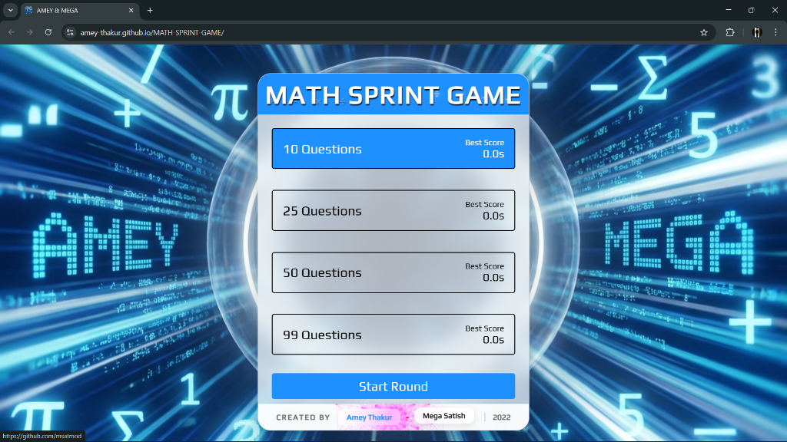
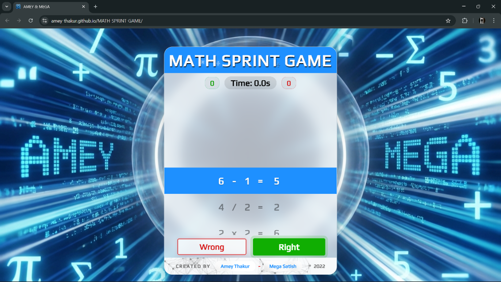
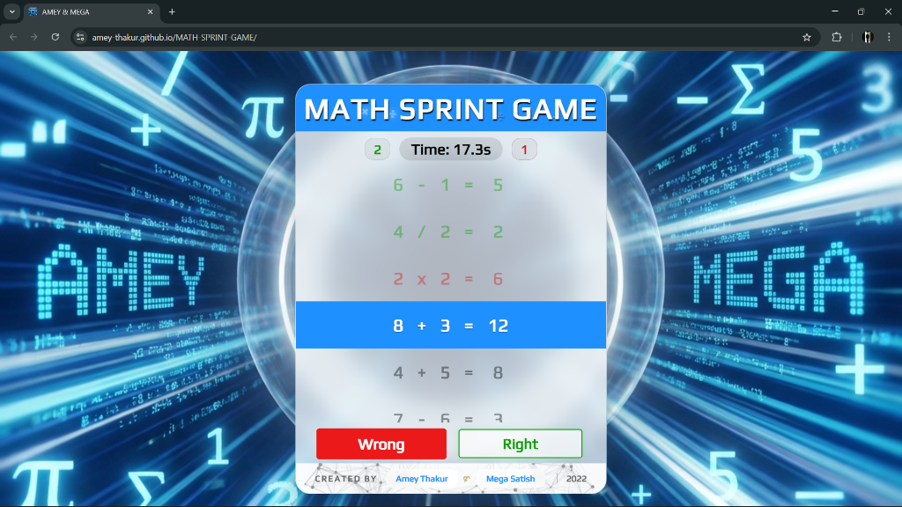
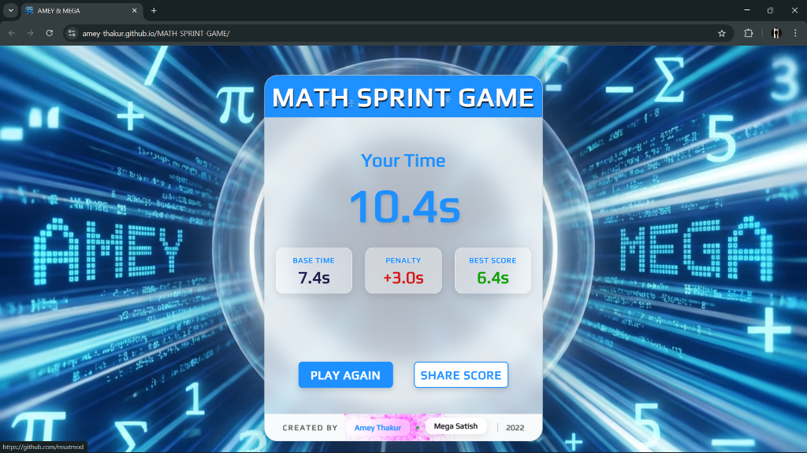
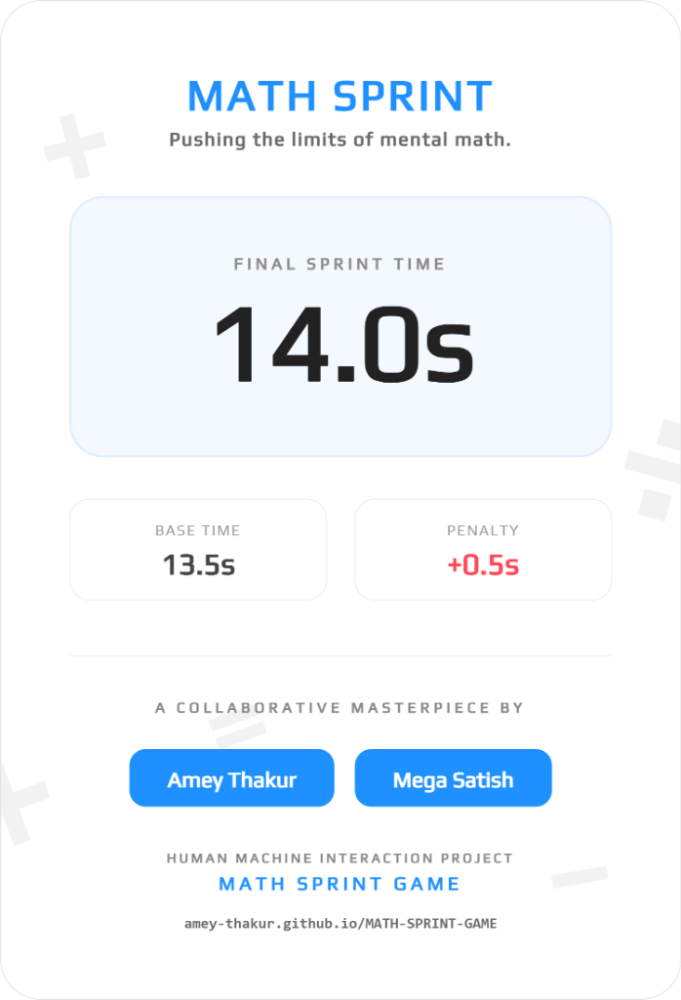

<div align="center">

  <a name="readme-top"></a>
  # Math Sprint Game

  [](LICENSE)
  
  [](https://github.com/Amey-Thakur/MATH-SPRINT-GAME)
  [](https://github.com/Amey-Thakur/MATH-SPRINT-GAME)

  A fast-paced educational web game where players race against time to solve math equations, testing speed and accuracy.

  **[Source Code](Source%20Code/)** &nbsp;·&nbsp; **[Technical Specification](docs/SPECIFICATION.md)** &nbsp;·&nbsp; **[Live Demo](https://amey-thakur.github.io/MATH-SPRINT-GAME/)**

</div>

---

<div align="center">

  [Authors](#authors) &nbsp;·&nbsp; [Overview](#overview) &nbsp;·&nbsp; [Features](#features) &nbsp;·&nbsp; [Structure](#project-structure) &nbsp;·&nbsp; [Results](#results) &nbsp;·&nbsp; [Quick Start](#quick-start) &nbsp;·&nbsp; [Usage Guidelines](#usage-guidelines) &nbsp;·&nbsp; [License](#license) &nbsp;·&nbsp; [About](#about-this-repository) &nbsp;·&nbsp; [Acknowledgments](#acknowledgments)

</div>

---

<!-- AUTHORS -->
<div align="center">

  <a name="authors"></a>
  ## Authors

  **Terna Engineering College | Computer Engineering | Batch of 2022**

| <a href="https://github.com/Amey-Thakur"></a><br>[**Amey Thakur**](https://github.com/Amey-Thakur)<br><br>[](https://orcid.org/0000-0001-5644-1575) | <a href="https://github.com/msatmod"></a><br>[**Mega Satish**](https://github.com/msatmod)<br><br>[](https://orcid.org/0000-0002-1844-9557) |
| :---: | :---: |

</div>

> [!IMPORTANT]
> ### 🤝🏻 Special Acknowledgement
> *Special thanks to **[Mega Satish](https://github.com/msatmod)** for her meaningful contributions, guidance, and support that helped shape this work.*

---

<!-- OVERVIEW -->
<a name="overview"></a>
## Overview

**Math Sprint Game** is a time-sensitive cognitive challenge that leverages **gamification mechanics** to reinforce arithmetic proficiency. The purpose of the system is to improve mental processing speed through a focused, high-intensity user interface.

### HMI Principles
The development of this interface was guided by core **Human-Machine Interaction** paradigms:
*   **Cognitive Pacing**: The interface enforces a rapid interaction rhythm, encouraging the user to enter a "flow state" where cognition and action are synchronized.
*   **Instantaneous Feedback Loops**: Immediate visual signaling of success or error provides the reinforcement schedule necessary for rapid learning and behavior modification.

> [!TIP]
> **Cognitive Load Management**
>
> The game employs a "Flash Card" visual metaphor, presenting one problem at a time to prevent **choice paralysis**. By isolating the active variable (the equation) and providing binary input options (Right/Wrong), the design effectively manages the user's working memory, strictly adhering to the HMI principle of **Minimizing Cognitive Load**.

---

<!-- FEATURES -->
<a name="features"></a>
## Features

| Feature | Description |
|---------|-------------|
| **Interactive Gameplay** | Rapid-fire equation challenges with immediate **visual feedback** (Correct/Wrong). |
| **Premium Analytics** | **High-Fidelity PDF-Ready Share Cards** generated instantly for performance sharing. |
| **Score Tracking** | Persistent high score system using Web LocalStorage with **penalty-integrated logic**. |
| **HCI Principles** | Clean interface design focusing on **Minimizing Cognitive Load** and reaction time. |
| **Adaptive Performance** | Fully responsive design with **GPU-accelerated animations** and smooth scrolling. |
| **Audio Immersion** | Responsive auditory feedback layers for countdowns and scoring states. |

> [!NOTE]
> ### Interactive Polish: Immersive Auditory Feedback
> We have integrated a responsive auditory layer into the gameplay loop to reinforce the player’s pacing and focus. These acoustic signals are designed to provide instantaneous cognitive feedback, transforming each round into a high-intensity mental sprint within a refined digital environment. Complementing this experience, the application includes a high-fidelity performance summary feature, with each shareable scorecard digitally signed by **Amey & Mega**.

### Tech Stack
- **Languages**: HTML5, CSS3, JavaScript (ES6+)
- **Logic**: Vanilla JS (Advanced DOM & Web Audio API)
- **Imaging**: **html2canvas** (Custom high-fidelity capture engine)
- **UI System**: Premium Glassmorphic Design (Custom Vanilla CSS3)
- **Deployment**: GitHub Actions (Staging & Continuous Delivery Workflow)
- **Hosting**: GitHub Pages

---

<!-- STRUCTURE -->
<a name="project-structure"></a>
## Project Structure

```python
MATH-SPRINT-GAME/
│
├── .github/                         # GitHub Actions & Automation
│   └── workflows/
│       └── deploy.yml               # Automated Staging & Deployment Flow
│
├── docs/                            # Technical Documentation
│   └── SPECIFICATION.md             # Architecture & Design Specification
│
├── Mega/                            # Archival Attribution Assets
│   ├── Filly.jpg                    # Companion (Filly)
│   └── Mega.png                     # Author Profile Image (Mega Satish)
│
├── screenshots/                     # Application Screenshots
│   ├── main-menu.png                # Start Screen & Question Selection
│   ├── game-page.png                # Primary Gameplay Interface
│   ├── game-feedback.png            # Visual Validation Feedback
│   ├── score-page.png               # Performance Results Overview
│   ├── share-card.png               # Premium Score Analytics Asset
│   └── gallery/                     # High-Resolution Social Assets
│
├── Source Code/                     # Primary Application Layer
│   ├── style.css                    # Game Styling
│   ├── script.js                    # Game Logic & State Management
│   ├── favicon.png                  # Application Icon
│   └── index.html                   # Game Interface
│
├── .gitattributes                   # Git configuration
├── CITATION.cff                     # Scholarly Citation Metadata
├── codemeta.json                    # Machine-Readable Project Metadata
├── LICENSE                          # MIT License Terms
├── README.md                        # Comprehensive Archival Entrance
└── SECURITY.md                      # Security Policy & Protocol
```

---

<!-- RESULTS -->
<a name="results"></a>
## Results

<div align="center">
  <b>Main Menu & Selection</b>
  <br><br>
  
  <br><br>

  <b>Active Gameplay Interface</b>
  <br><br>
  
  <br><br>

  <b>Binary Visual Feedback</b>
  <br><br>
  
  <br><br>

  <b>Performance Summary</b>
  <br><br>
  
  <br><br>

  <b>Premium Analytics Share Card</b>
  <br><br>
  
</div>

---

<!-- QUICK START -->
<a name="quick-start"></a>
## Quick Start

### 1. Prerequisites
- **Browser**: Any modern standards-compliant web browser (Chrome, Firefox, Edge, Safari).
- **Environment**: No server-side runtime is required; this is a static client-side application.

> [!WARNING]
> **Local Execution**
>
> While the project can be executed by opening `index.html` directly, certain features may require an active internet connection to resolve external libraries correctly.

### 2. Setup & Deployment
1.  **Clone the Repository**:
    ```bash
    git clone https://github.com/Amey-Thakur/MATH-SPRINT-GAME.git
    cd MATH-SPRINT-GAME
    ```
2.  **Launch**:
    Open `Source Code/index.html` in your preferred browser.

> [!TIP]
> **Educational Gamification | Math Sprint Game**
> 
> Experience a high-fidelity web simulation of this competitive arithmetic platform, featuring a "Flash Card" visual metaphor and HMI-optimized feedback loops designed to enhance mental processing speed through gamified cognitive challenges.
>
> [**Launch Live Demo**](https://amey-thakur.github.io/MATH-SPRINT-GAME/)

---

<!-- =========================================================================================
                                     USAGE SECTION
     ========================================================================================= -->
## Usage Guidelines

This repository is openly shared to support learning and knowledge exchange across the academic community.

**For Students**  
Use this project as reference material for understanding interactive system design, web development patterns, and Human Machine Interaction principles. The source code is available for study to facilitate self-paced learning and exploration of user-centric design patterns.

**For Educators**  
This project may serve as a practical lab example or supplementary teaching resource for Human Machine Interaction and Human Machine Interaction Laboratory courses (`CSC801` & `CSL801`). Attribution is appreciated when utilizing content.

**For Researchers**  
The documentation and design approach may provide insights into academic project structuring and interactive web application development.

---

<!-- LICENSE -->
<a name="license"></a>
## License

This repository and all its creative and technical assets are made available under the **MIT License**. See the [LICENSE](LICENSE) file for complete terms.

> [!NOTE]
> **Summary**: You are free to share and adapt this content for any purpose, even commercially, as long as you provide appropriate attribution to the original authors.

Copyright © 2022 Amey Thakur & Mega Satish

---

<!-- ABOUT -->
<a name="about-this-repository"></a>
## About This Repository

**Created & Maintained by**: [Amey Thakur](https://github.com/Amey-Thakur) & [Mega Satish](https://github.com/msatmod)  
**Academic Journey**: Bachelor of Engineering in Computer Engineering (2018-2022)  
**Institution**: [Terna Engineering College](https://ternaengg.ac.in/), Navi Mumbai  
**University**: [University of Mumbai](https://mu.ac.in/)

This project features the **Math Sprint Game**, developed as a **Human Machine Interaction** project during the **8th Semester Computer Engineering** curriculum. It showcases the use of web technologies to build interactive educational games.

**Connect:** [GitHub](https://github.com/Amey-Thakur) &nbsp;·&nbsp; [LinkedIn](https://www.linkedin.com/in/amey-thakur) &nbsp;·&nbsp; [ORCID](https://orcid.org/0000-0001-5644-1575)

### Acknowledgments

Grateful acknowledgment to [**Mega Satish**](https://github.com/msatmod) for her exceptional collaboration and scholarly partnership during the development of this educational game project. Her constant support, technical clarity, and dedication to software quality were instrumental in achieving the system's functional objectives. Learning alongside her was a transformative experience; her thoughtful approach to problem-solving and steady encouragement turned complex requirements into meaningful learning moments. This work reflects the growth and insights gained from our side-by-side academic journey. Thank you, Mega, for everything you shared and taught along the way.

Grateful acknowledgment to the faculty members of the **Department of Computer Engineering** at Terna Engineering College for their guidance and instruction in Human Machine Interaction. Their expertise and support helped develop a strong understanding of interactive system design.

Special thanks to the **mentors and peers** whose encouragement, discussions, and support contributed meaningfully to this learning experience.

---

<div align="center">

  [↑ Back to Top](#readme-top)

  [Authors](#authors) &nbsp;·&nbsp; [Overview](#overview) &nbsp;·&nbsp; [Features](#features) &nbsp;·&nbsp; [Structure](#project-structure) &nbsp;·&nbsp; [Results](#results) &nbsp;·&nbsp; [Quick Start](#quick-start) &nbsp;·&nbsp; [Usage Guidelines](#usage-guidelines) &nbsp;·&nbsp; [License](#license) &nbsp;·&nbsp; [About](#about-this-repository) &nbsp;·&nbsp; [Acknowledgments](#acknowledgments)

  <br>

  🔬 **[Human Machine Interaction Laboratory](https://github.com/Amey-Thakur/HUMAN-MACHINE-INTERACTION-AND-HUMAN-MACHINE-INTERACTION-LAB)** &nbsp; · &nbsp; 🔢 **[MATH-SPRINT-GAME](https://amey-thakur.github.io/MATH-SPRINT-GAME)**

  ---

  ### 🎓 [Computer Engineering Repository](https://github.com/Amey-Thakur/COMPUTER-ENGINEERING)

  **Computer Engineering (B.E.) - University of Mumbai**

  *Semester-wise curriculum, laboratories, projects, and academic notes.*

</div>
