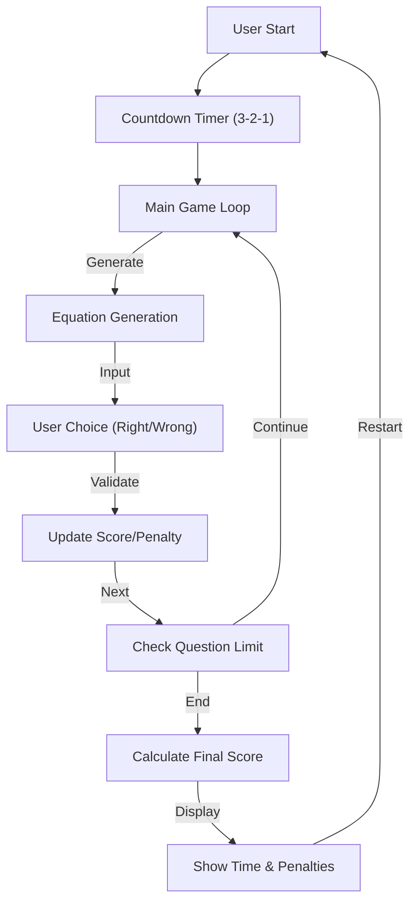

# Technical Specification: Math Sprint Game

## Architectural Overview

The **Math Sprint Game** is a time-constrained educational web application designed to test and improve arithmetic speed and accuracy. The system creates a competitive environment where users solve a series of mathematical equations against a timer, simulating a "sprint" race against the clock.

### Game Logic Flow

---

## Technical Implementations

### 1. Frontend Architecture
-   **Structure**: Pure HTML5 provides the semantic skeleton, featuring a multi-view container system (Splash Page, Countdown, Game Page, Score Page) managed via DOM manipulation.
-   **Styling**: Custom CSS3 utilizes media queries for responsiveness, ensuring the game is playable on both desktop and mobile devices.

### 2. Core JavaScript Logic
-   **Equation Generation**: The `script.js` and `shuffle.js` modules generate random arithmetic problems (addition, subtraction, multiplication, division).
-   **Randomization**: To prevent pattern recognition, a shuffling algorithm ensures that the sequence of correct and incorrect equations is unpredictable.
-   **Timer & Penalty System**: 
    -   The application tracks the time taken to complete the set number of questions.
    -   Incorrect answers incur a time penalty, adding seconds to the final score, thereby incentivizing accuracy over raw clicking speed.
-   **Persistence**: `localStorage` is used to save the user's best scores, providing a mechanism for long-term progress tracking.

### 3. Deployment Pipeline
-   **Automation**: GitHub Actions handles the deployment of the static assets from the `Source Code` directory to GitHub Pages.

---

## Technical Prerequisites

-   **Runtime**: A modern web browser with JavaScript enabled.
-   **Dependencies**: None. The application is built with Vanilla JavaScript and has no external library dependencies.

---

*Technical Specification | Human Machine Interaction | Version 1.0*
